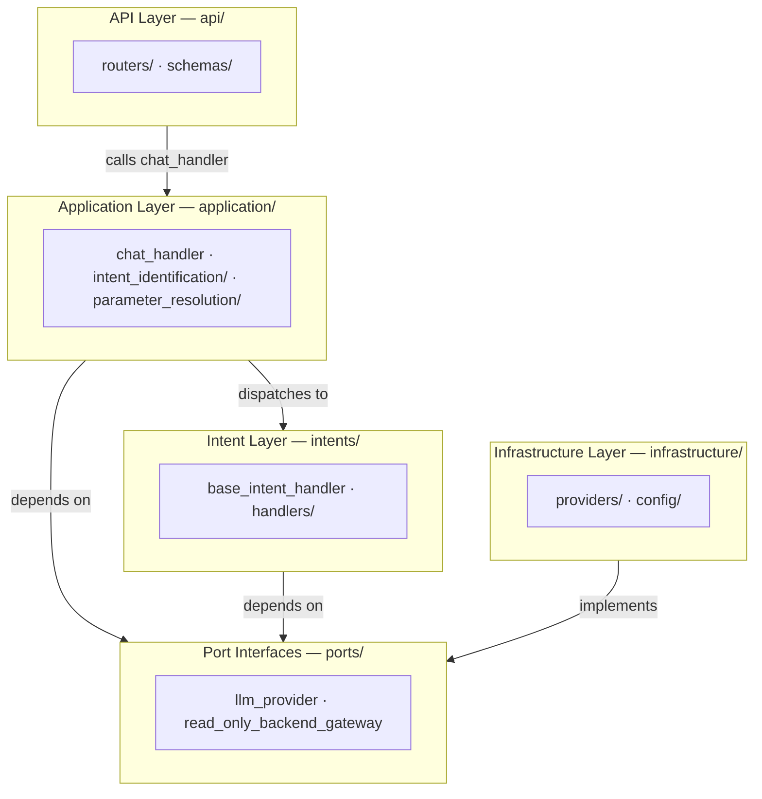
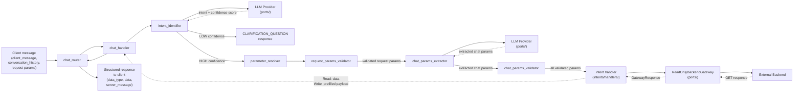

# Detailed Explanation for AI Agents — Chat-to-Intent Server

This document defines a **generalized chat-to-intent server structure** for backend developer AI agents. It is intended to guide file placement, responsibility boundaries, pipeline design, and implementation patterns for a server that sits between a frontend chatroom and external backend services, using an LLM to classify user intent and return either fetched data or a pre-filled write payload.

This server owns no domain state and enforces no business invariants. External backends own all business logic. This server is a **structured intent-resolution and read-only gateway** that:

1. receives a natural-language `client_message` and `conversation_history` from the frontend chatroom
2. classifies the message into a pre-determined intent using an LLM
3. validates request parameters and extracts chat-driven parameters
4. for **Read Intents**: fetches data from external backends via a read-only gateway and returns it
5. for **Write Intents**: assembles a best-effort pre-filled form payload for the frontend to render and submit

The client is responsible for rendering, form submission, and UX around the chat loop.

---

# Generalized Chat-to-Intent Server Structure for AI Agents

```text
app/                                              # Root application package.
│
├── api/                                          # HTTP interface layer; receives chat messages and returns structured responses.
│   ├── routers/
│   │   └── chat_router.py                        # Defines the POST chat endpoint; delegates to the application layer.
│   │
│   └── schemas/
│       ├── chat_request_schema.py                # Inbound shape: client_message, conversation_history, request params, headers.
│       └── chat_response_schema.py               # Outbound envelope: data_type, data, server_message.
│
├── application/                                  # Application layer; orchestrates the full intent pipeline.
│   ├── chat_handler.py                           # Main orchestrator; wires intent identification, parameter resolution, and intent processing.
│   │
│   ├── intent_identification/
│   │   ├── intent_registry.py                    # Hardcoded registry of all supported intents and their metadata.
│   │   └── intent_identifier.py                  # Calls LLM to classify client_message into a registered intent; returns intent + confidence.
│   │
│   └── parameter_resolution/
│       ├── parameter_resolver.py                 # Orchestrates the three sequential parameter sub-layers.
│       ├── request_params_validator.py           # Sub-layer 1: validates Required/Optional Request Parameters from the HTTP request.
│       ├── chat_params_extractor.py              # Sub-layer 2: uses LLM to best-effort extract chat-driven parameters from client_message.
│       └── chat_params_validator.py              # Sub-layer 3: validates presence and type of Required/Optional Chat-Driven Parameters.
│
├── intents/                                      # Intent layer; one handler per registered intent that resolves data or builds the prefilled payload.
│   ├── base_intent_handler.py                    # Abstract base class all intent handlers implement.
│   └── handlers/                                 # Concrete handlers, one per intent.
│       └── <intent>_handler.py                   # Handles one specific intent using ReadOnlyBackendGateway.
│
├── ports/                                        # Abstract interfaces for infrastructure dependencies.
│   ├── llm_provider.py                           # Abstract contract for LLM completion calls.
│   └── read_only_backend_gateway.py              # Abstract contract exposing only .get(); enforces no-mutation constraint at the type level.
│
├── infrastructure/                               # Concrete implementations of ports and configuration.
│   ├── providers/
│   │   ├── openai_provider.py                    # Implements LLMProvider using the OpenAI API.
│   │   └── read_only_backend_client.py           # Implements ReadOnlyBackendGateway using httpx; exposes only .get().
│   │
│   └── config/
│       └── settings.py                           # Environment variables: LLM API key, external backend base URLs, model names.
│
├── dependencies.py                               # Composition root; wires ports to implementations and injects into handlers.
└── main.py                                       # Application entrypoint; creates the app and registers routers.
```

---

## High-Level Architecture Overview

### Layer Architecture and Dependency Direction



### Typical Request Flow



---

# Detailed Explanation for AI Agents

## 1. `app/`

**Purpose:**
Top-level package for the chat-to-intent server.

**Rules for AI agents:**
- All server code must live under this root.
- This server owns **no domain logic** and **no domain state**. Business rules, invariants, and state belong in the external backends.
- The server never issues write calls (POST, PUT, PATCH, DELETE) to any external backend. All external calls go through `ReadOnlyBackendGateway`, which exposes only `.get()`.

---

## 2. `api/`

**Purpose:**
Expose the chat-to-intent server over HTTP. This layer handles protocol concerns only.

**What belongs here:**
- route handlers
- request parsing (extracting `client_message`, `last_server_message`, path params, query params, header values)
- response serialization into the `data_type / data / server_message` envelope
- HTTP status codes

**What does not belong here:**
- LLM prompt construction
- intent classification logic
- parameter extraction or validation
- calls to external backends

---

### 2.1 `api/routers/chat_router.py`

**Purpose:**
Define the single POST endpoint that the frontend chatroom calls.

**One-line purpose:** Receives the client's chat request, delegates to the chat handler, and serializes the structured result into the API response envelope.

**Rules for AI agents:**
- The router must be thin — one endpoint, one delegation call.
- It extracts `client_message`, `conversation_history`, and all other request parameters (path, query, body, headers) from the incoming request.
- It passes all extracted values to the chat handler.
- It converts the chat handler's result into `ChatResponse` and returns it.
- It must not classify intent, call the LLM, or call any external backend directly.

**Good router responsibilities:**
- validate incoming request shape
- extract header values (auth token, tenant ID, locale, etc.)
- call the injected chat handler
- convert the result into the response envelope (`data_type`, `data`, `server_message`)
- return appropriate HTTP status code

**Bad router responsibilities:**
- calling the LLM directly
- calling external backends directly
- classifying intent
- building prompts
- validating business parameters

---

### 2.2 `api/schemas/chat_request_schema.py`

**Purpose:**
Define the inbound shape of the chat request.

**One-line purpose:** Declares every field the client sends in a chat request — including the full conversation history for multi-turn context.

**Rules for AI agents:**
- Every request must include `client_message` and `conversation_history`.
  - `client_message`: the user's current natural-language input.
  - `conversation_history`: the ordered list of previous turns in the session, each with a `role` (`"user"` or `"assistant"`) and `content` string. Empty list on the first turn. The client is responsible for accumulating and sending all prior turns on each request.
- All other request parameters (path params, query params, body fields) declared by each intent's registry entry are also part of the inbound request.
- On every follow-up turn, the client re-sends the **full original request** — all parameters must be present, with `conversation_history` updated to include all turns so far.
- The client controls how much history to send. The default behavior is to send the full session history.

**Example shape:**
```python
from typing import Literal
from pydantic import BaseModel

class ConversationTurn(BaseModel):
    role: Literal["user", "assistant"]
    content: str

class ChatRequest(BaseModel):
    client_message: str
    conversation_history: list[ConversationTurn] = []
    # Additional intent-specific request parameters are defined per domain
```

---

### 2.3 `api/schemas/chat_response_schema.py`

**Purpose:**
Define the top-level response envelope returned to the client.

**One-line purpose:** Declares the fixed three-field response shape used by every response regardless of `data_type`.

**Rules for AI agents:**
- Every response — success, clarification, or error — uses this exact envelope.
- `data_type`: the semantic category of the response. Possible universal values: `CLARIFICATION_QUESTION`, `ERROR`. Domain-specific values are one per supported intent (e.g. `GET_STANDINGS`, `REGISTER_PLAYER`).
- `data`: the payload. Its schema varies by `data_type`:
  - `CLARIFICATION_QUESTION`: `{ "question": "<string>" }`
  - `ERROR`: `{ "status_code": <int>, "error_message": "<string>" }`
  - Read Intent types: the requested domain data (shape defined per intent)
  - Write Intent types: always `{ "method": ..., "url": ..., "body": { ... } }` (the prefilled payload schema)
- `server_message`: always present. Empty string when nothing to report. Never populated for `ERROR` responses.

```python
class ChatResponse(BaseModel):
    data_type: str
    data: dict
    server_message: str
```

---

## 3. `application/`

**Purpose:**
Orchestrate the full intent pipeline. This layer coordinates the flow without owning any business rules.

**What belongs here:**
- the main chat handler orchestrator
- intent identification (registry, LLM classification, confidence evaluation)
- parameter resolution (three sequential sub-layers)

**What does not belong here:**
- HTTP request/response handling
- concrete LLM API calls (those go in infrastructure)
- concrete external backend HTTP calls (those go in infrastructure)
- business rules (those belong in external backends)

---

### 3.1 `application/chat_handler.py`

**Purpose:**
Main orchestrator that wires the full pipeline together.

**One-line purpose:** Receives all parsed request values from the router, runs intent identification and parameter resolution, dispatches to the correct intent handler, and returns a structured `ChatResponse`.

**Rules for AI agents:**
- This is the single entry point called by the router.
- It depends on the intent identifier, parameter resolver, and intent handler registry — not on concrete infrastructure.
- It handles top-level error catching (LLM failures, unrecognized intents, backend errors) and returns structured responses rather than raising HTTP exceptions.
- All extracted header values (auth token, tenant ID, etc.) are passed through to the intent handler for use in `ReadOnlyBackendGateway` calls.

**Typical flow:**
```python
class ChatHandler:
    async def handle(self, request: ParsedChatRequest) -> ChatResponse:
        identification = await self.intent_identifier.identify(
            client_message=request.client_message,
            conversation_history=request.conversation_history,
        )

        if identification.confidence == Confidence.LOW:
            return ChatResponse(
                data_type="CLARIFICATION_QUESTION",
                data={"question": identification.clarification_question},
                server_message="",
            )

        params = await self.parameter_resolver.resolve(
            intent=identification.intent,
            client_message=request.client_message,
            conversation_history=request.conversation_history,
            league_id=request.league_id,
            host_token=request.host_token,
        )

        handler = self.handler_registry.get(identification.intent.name)
        return await handler.handle(params=params, headers=request.headers)
```

---

### 3.2 `application/intent_identification/intent_registry.py`

**Purpose:**
Declare every supported intent and its metadata as a single, hardcoded, authoritative registry.

**One-line purpose:** Single source of truth for all intents this server can handle — including their type, confidence threshold, parameter schemas, and LLM prompt hints.

**Rules for AI agents:**
- The registry is a designated class (not a config file or database). Each entry must declare:
  - `name`: the intent identifier, verb-noun formatted (e.g. `GET_STANDINGS`, `REGISTER_PLAYER`)
  - `intent_type`: `READ` or `WRITE`
  - `confidence_threshold`: per-intent override (integer 0–100); omit to inherit the system default of `70`
  - `required_request_params`: list of parameter definitions (name, type)
  - `optional_request_params`: list of parameter definitions (name, type)
  - `required_chat_params`: list of parameter definitions (name, type)
  - `optional_chat_params`: list of parameter definitions (name, type)
  - `description`: natural-language description used in the LLM classification prompt
  - `example_messages`: list of example `client_message` strings for few-shot prompting
- When adding a new intent, the entry is added here first. Nothing else in the pipeline changes.
- The `intent_identifier` reads this registry to construct the LLM prompt and to validate the LLM's returned intent name against known entries.

**Example:**
```python
@dataclass
class IntentDefinition:
    name: str
    intent_type: IntentType  # READ or WRITE
    confidence_threshold: int = 70
    required_request_params: list[ParamDef] = field(default_factory=list)
    optional_request_params: list[ParamDef] = field(default_factory=list)
    required_chat_params: list[ParamDef] = field(default_factory=list)
    optional_chat_params: list[ParamDef] = field(default_factory=list)
    description: str = ""
    example_messages: list[str] = field(default_factory=list)

class IntentRegistry:
    INTENTS: list[IntentDefinition] = [
        IntentDefinition(
            name="GET_STANDINGS",
            intent_type=IntentType.READ,
            confidence_threshold=70,
            required_chat_params=[ParamDef("season_id", int)],
            description="User wants to see the league standings for a season.",
            example_messages=["show me the standings", "what are the standings for season 3?"],
        ),
        IntentDefinition(
            name="REGISTER_PLAYER",
            intent_type=IntentType.WRITE,
            confidence_threshold=75,
            required_chat_params=[ParamDef("player_id", str)],
            optional_chat_params=[ParamDef("position", str), ParamDef("shirt_number", int)],
            description="User wants to register a player for a season.",
            example_messages=["register player John", "add player_456 to season 3"],
        ),
    ]

    @classmethod
    def get(cls, name: str) -> IntentDefinition | None:
        return next((i for i in cls.INTENTS if i.name == name), None)
```

---

### 3.3 `application/intent_identification/intent_identifier.py`

**Purpose:**
Call the LLM to classify the user's `client_message` into a registered intent and determine confidence.

**One-line purpose:** Constructs the classification prompt from the registry, calls the LLM provider, validates the returned intent name against the registry, and converts the numeric score to `HIGH` or `LOW` confidence.

**Rules for AI agents:**
- The identifier depends on `LLMProvider` (the port), not a concrete OpenAI client.
- It constructs the classification prompt from `IntentRegistry` — including all intent descriptions and few-shot examples.
- The prompt **must** include an explicit instruction: *"If the user's message appears to request more than one action, you must assign a confidence score below the threshold and ask the user to specify which action they want to perform first."*
- The LLM returns a numeric confidence score (0–100) alongside the intent name. The identifier converts it using the intent's declared threshold (or the system default of 70): score ≥ threshold → `HIGH`; score < threshold → `LOW`.
- **Hard gate:** before applying confidence, the identifier validates that the LLM's returned intent name matches an entry in the registry. An unrecognized name (hallucination or out-of-vocabulary) must immediately return an `ERROR` response (`status_code 422`) — confidence score is irrelevant in this case.
- On `LOW` confidence, the identifier generates a clarification question for the user (as `data.question`) using the LLM.

**What this file owns:**
- the classification prompt template (built from the registry)
- formatting `conversation_history` + `client_message` into the LLM user message
- LLM output parsing into intent name + numeric score
- registry validation (hard gate)
- threshold evaluation → `HIGH` / `LOW`
- clarification question generation on `LOW` confidence

**What this file does NOT own:**
- the concrete LLM API call (that is in the port/provider)
- the intent registry definition (that is in `intent_registry.py`)
- parameter extraction (that is in `parameter_resolution/`)

---

## 4. `application/parameter_resolution/`

**Purpose:**
Validate and extract all parameters for the identified intent through three sequential sub-layers.

**What belongs here:**
- the parameter resolver orchestrator
- the three validation/extraction sub-layers

**Key concepts:**
- Each intent declares four parameter categories: **Required Request Parameters**, **Optional Request Parameters**, **Required Chat-Driven Parameters**, **Optional Chat-Driven Parameters**.
- If a provided value has the wrong type or is otherwise invalid, the value is **not filled** and the issue is recorded with a descriptive message (e.g. `"shirt_number: expected number, got string"`). All recorded issues are included in `server_message`.
- A skipped value is treated as absent — if the parameter is Required, the sub-layer raises an error response.
- This layer validates **type and presence only**. Semantic validation (e.g. whether a `player_id` refers to a real player) happens in the Intent Process Layer when actual GET calls are made.

---

### 4.1 `application/parameter_resolution/parameter_resolver.py`

**Purpose:**
Orchestrate the three parameter sub-layers in sequence and return the full validated parameter set.

**One-line purpose:** Runs request param validation → chat param extraction → chat param validation in order; returns all resolved parameters or raises an error response.

**Rules for AI agents:**
- Calls the three sub-layers in strict sequence.
- Collects all recorded issues from all sub-layers and accumulates them for inclusion in `server_message`.
- Returns the merged parameter set (request params + chat-driven params) on success.
- Propagates error responses from sub-layers immediately — does not continue to subsequent sub-layers after an error.

---

### 4.2 `application/parameter_resolution/request_params_validator.py`

**Purpose:**
Validate that all Required Request Parameters for the identified intent are present and correctly typed in the HTTP request.

**One-line purpose:** Checks presence and type of request-level parameters (path, query, body); raises a 400 ERROR response if any required one is missing or invalid.

**Rules for AI agents:**
- Explicitly ignores chat-driven parameters — this sub-layer only handles request-level params.
- For each Required Request Parameter:
  - If missing or type-mismatched: skip and record the issue; raise ERROR (status_code 400) at the end if any required one is unresolved.
- For each Optional Request Parameter:
  - Best-effort collection; skip and record the issue if absent or invalid — no error is raised.
- Returns a `ValidatedParams` object (or raises an error response).

---

### 4.3 `application/parameter_resolution/chat_params_extractor.py`

**Purpose:**
Use the LLM to best-effort extract all chat-driven parameters from the user's `client_message` and `conversation_history`.

**One-line purpose:** Sends a structured extraction prompt to the LLM provider, including full conversation context, and returns raw extracted values for both Required and Optional chat-driven parameters.

**Rules for AI agents:**
- Depends on `LLMProvider` (the port), not a concrete LLM client.
- Accepts `conversation_history` alongside `client_message`; if history is non-empty, the full transcript is passed to the LLM so parameter values mentioned in earlier turns can be extracted (e.g. player names said two turns ago).
- Does **not** validate whether required chat-driven parameters are present — extraction only.
- Does **not** raise errors if parameters cannot be extracted — returns them as absent.
- Returns a map of parameter name → extracted value (or `None` if not found).
- The Intent Process Layer never re-runs extraction — all extraction is done here.

---

### 4.4 `application/parameter_resolution/chat_params_validator.py`

**Purpose:**
Validate the chat-driven parameters extracted by the previous sub-layer.

**One-line purpose:** Checks presence and type of extracted chat-driven parameters; raises a 400 ERROR response if any required one is missing or invalid.

**Rules for AI agents:**
- Mirrors `request_params_validator.py` but operates on chat-driven parameters only.
- For each Required Chat-Driven Parameter:
  - If not extracted or type-mismatched: skip and record the issue; raise ERROR (status_code 400) at the end if any required one is unresolved.
- For each Optional Chat-Driven Parameter:
  - Best-effort collection; skip and record the issue if absent or invalid — no error is raised.
- Returns a `ValidatedParams` object (or raises an error response).

---

## 5. `intents/`

**Purpose:**
Define one handler per registered intent that resolves data (Read) or assembles the prefilled payload (Write) using only read-only external backend calls.

**What belongs here:**
- the abstract base intent handler
- one concrete handler per intent

**What does not belong here:**
- LLM calls (those go in `application/`)
- parameter extraction or validation (those go in `application/parameter_resolution/`)
- HTTP request/response handling
- any POST, PUT, PATCH, or DELETE calls to external backends (strictly forbidden)

---

### 5.1 `intents/base_intent_handler.py`

**Purpose:**
Define the abstract contract all intent handlers implement.

**One-line purpose:** Declares the interface every intent handler must follow so the chat handler can invoke any handler uniformly.

**Rules for AI agents:**
- Defines a `handle(params, headers) -> ChatResponse` abstract method.
- All concrete handlers inherit from this base.
- Handlers receive the `ReadOnlyBackendGateway` through dependency injection at construction time.

```python
from abc import ABC, abstractmethod

class BaseIntentHandler(ABC):
    @abstractmethod
    async def handle(self, params: ResolvedParams, headers: RequestHeaders) -> ChatResponse: ...
```

---

### 5.2 `intents/handlers/<intent>_handler.py`

**Purpose:**
Implement one specific intent: fetch data (Read) or assemble the prefilled payload (Write) using `ReadOnlyBackendGateway`.

**One-line purpose:** Translates validated parameters into GET calls to external backends and returns the correctly shaped `ChatResponse`.

**Rules for AI agents:**
- One handler file per intent.
- The handler depends on `ReadOnlyBackendGateway` (the port), not a concrete HTTP client.
- **Only `.get()` is available.** Calling `.post()`, `.put()`, `.patch()`, or `.delete()` on any external backend from within this layer is strictly forbidden.
- The handler may forward header values (auth token, tenant ID, locale) from `RequestHeaders` when calling external backends via the gateway — see Appendix G.
- **Read Intent handlers** must transform and reshape external backend responses into the intent-specific data shape. Raw backend responses are never passed through directly.
- **Write Intent handlers** assemble the prefilled payload: `method`, `url` (fully resolved — no unsubstituted placeholders), and `body` (each field with `type`, `required`, `value`, and `options` for enums). The `value` for each field comes directly from the validated `ResolvedParams` — the handler must not re-run LLM extraction.
- Headers are excluded from the prefilled payload. The client already holds them and will attach them directly when submitting the form.

**External GET Call Error Handling:**
- **Transient errors (network timeout, 503):** retry; if retries exhausted, return ERROR response (status_code 502).
- **Not Found (404):** bubble up immediately as ERROR (status_code 502) with descriptive `error_message`.
- **Other 4xx:** unrecoverable; bubble up as ERROR (status_code 502).
- **Other 5xx:** one retry attempt; if retry fails, bubble up as ERROR (status_code 502).
- If a failing GET call was supplementary (e.g. pre-filling an optional field), the handler may choose to proceed with a partial result and surface the issue in `server_message` rather than failing the entire request. This is fully discretionary — each handler decides independently.

**Read Intent handler example:**
```python
class GetStandingsHandler(BaseIntentHandler):
    def __init__(self, gateway: ReadOnlyBackendGateway):
        self.gateway = gateway

    async def handle(self, params: ResolvedParams, headers: RequestHeaders) -> ChatResponse:
        response = await self.gateway.get(
            path=f"/seasons/{params['season_id']}/standings",
            auth_token=headers.auth_token,
        )
        if not response.is_success:
            return error_response(502, f"Could not fetch standings: {response.body}")
        return ChatResponse(
            data_type="GET_STANDINGS",
            data={
                "season_id": params["season_id"],
                "standings": response.body["standings"],
            },
            server_message="",
        )
```

**Write Intent handler example:**
```python
class RegisterPlayerHandler(BaseIntentHandler):
    async def handle(self, params: ResolvedParams, headers: RequestHeaders) -> ChatResponse:
        return ChatResponse(
            data_type="REGISTER_PLAYER",
            data={
                "method": "POST",
                "url": f"https://api.example.com/seasons/{params['season_id']}/registrations",
                "body": {
                    "player_id": {"type": "string", "required": True, "value": params.get("player_id")},
                    "shirt_number": {"type": "number", "required": False, "value": params.get("shirt_number")},
                    "position": {"type": "enum", "required": False, "options": ["GK", "DEF", "MID", "FWD"], "value": params.get("position")},
                },
            },
            server_message=params.recorded_issues_summary(),
        )
```

---

## 6. `ports/`

**Purpose:**
Define abstract interfaces for infrastructure dependencies so the application and intent layers depend on abstractions, not concrete SDKs or HTTP clients.

---

### 6.1 `ports/llm_provider.py`

**Purpose:**
Declare the abstract contract for LLM completion calls.

**One-line purpose:** Defines what the intent identifier and chat-param extractor need — a way to send a prompt and receive a text response — without depending on a specific LLM vendor.

**Rules for AI agents:**
- This is an interface only. No implementation logic here.
- Expose a low-level `complete(system_prompt, user_message) -> str` method. The application layer owns prompt construction and output parsing.
- Do not put classification or extraction logic in the port.

```python
from typing import Protocol

class LLMProvider(Protocol):
    async def complete(self, system_prompt: str, user_message: str) -> str: ...
```

---

### 6.2 `ports/read_only_backend_gateway.py`

**Purpose:**
Declare the abstract contract for read-only HTTP communication with external backends.

**One-line purpose:** Defines a gateway that exposes **only `.get()`**, making the no-mutation constraint type-safe — it is impossible to accidentally call `.post()` or `.put()` from within the intent layer.

**Rules for AI agents:**
- This is an interface only. No implementation logic here.
- Exposes **only** a `.get()` method. There is no `.post()`, `.put()`, `.patch()`, or `.delete()`.
- `.get()` returns a `GatewayResponse` containing `status_code`, `body`, and `is_success`.
- The gateway must never raise exceptions for non-2xx responses — it returns them as structured responses so handlers can decide error handling explicitly.
- Header values (auth token, tenant ID, etc.) are passed per-call so each handler can forward them as needed.

```python
from typing import Protocol
from dataclasses import dataclass

@dataclass
class GatewayResponse:
    status_code: int
    body: dict
    is_success: bool

class ReadOnlyBackendGateway(Protocol):
    async def get(
        self,
        path: str,
        auth_token: str,
        params: dict | None = None,
        headers: dict | None = None,
    ) -> GatewayResponse: ...
```

**Why only `.get()` and not the full set of HTTP methods:**
The chat-to-intent server must never mutate external backend state. Restricting the port to `.get()` makes this constraint a compile-time/type-check guarantee rather than a code-review convention. Any attempt to issue a write call from within an intent handler fails at the type level, not just at runtime.

---

## 7. `infrastructure/`

**Purpose:**
Concrete implementations of the LLM provider and read-only backend HTTP client.

**What belongs here:**
- concrete LLM API client (OpenAI SDK wrapper)
- concrete read-only backend HTTP client (httpx wrapper, GET-only)
- configuration and settings

**What does not belong here:**
- prompt construction or output parsing
- intent routing or dispatch logic
- API request/response schema definitions
- business rules

---

### 7.1 `infrastructure/providers/openai_provider.py`

**Purpose:**
Implement the `LLMProvider` port using the OpenAI API.

**One-line purpose:** Sends prompts to OpenAI and returns raw text completions.

**Rules for AI agents:**
- Implements the `LLMProvider` port from `ports/`.
- Handles OpenAI SDK setup, API key management, model selection, and retry logic.
- Must not construct classification or extraction prompts — it only delivers them.
- Swap this file to change LLM vendors without touching application code.

---

### 7.2 `infrastructure/providers/read_only_backend_client.py`

**Purpose:**
Implement the `ReadOnlyBackendGateway` port using httpx.

**One-line purpose:** Makes GET-only HTTP calls to external backends and returns structured responses.

**Rules for AI agents:**
- Implements the `ReadOnlyBackendGateway` port from `ports/`.
- Exposes only a `.get()` method — no other HTTP methods are implemented.
- Manages the base URL, connection pooling, timeout settings, and auth token forwarding.
- Must not raise exceptions for non-2xx responses — wraps them in `GatewayResponse`.
- Forwards the auth token as a Bearer token in the Authorization header by default; additional header values may be forwarded per-call.

```python
import httpx

class ReadOnlyBackendClient:
    def __init__(self, base_url: str):
        self.client = httpx.AsyncClient(base_url=base_url)

    async def get(
        self,
        path: str,
        auth_token: str,
        params: dict | None = None,
        headers: dict | None = None,
    ) -> GatewayResponse:
        request_headers = {"Authorization": f"Bearer {auth_token}", **(headers or {})}
        response = await self.client.get(path, params=params, headers=request_headers)
        return GatewayResponse(
            status_code=response.status_code,
            body=response.json(),
            is_success=200 <= response.status_code < 300,
        )
```

---

### 7.3 `infrastructure/config/settings.py`

**Purpose:**
Centralize environment variables and configuration.

**One-line purpose:** Loads LLM API keys, external backend base URLs, model names, and confidence defaults from the environment.

**Rules for AI agents:**
- Keep all configuration here.
- Do not scatter environment variable reads across providers or handlers.
- Expose settings as a typed object for dependency injection.

---

## 8. `dependencies.py`

**Purpose:**
Composition root and dependency injection wiring.

**One-line purpose:** Connects abstract ports to concrete implementations and constructs the full pipeline with its dependencies.

**Rules for AI agents:**
- All dependency wiring belongs here, not in the application or intent layers.
- Creates the concrete LLM provider, read-only backend client, all intent handlers, the intent identifier, parameter resolver, and chat handler.
- The application layer must never instantiate infrastructure classes directly.

**Typical responsibilities:**
- create the concrete LLM provider (OpenAI)
- create the concrete read-only backend gateway (httpx client)
- create all intent handlers with the gateway injected
- build the intent handler registry mapping intent names to handlers
- create the parameter resolver (with the three sub-layers injected)
- create the intent identifier (with the LLM provider and registry injected)
- create the chat handler (with identifier, resolver, and handler registry injected)
- provide request-scoped dependencies for the router

---

## 9. `main.py`

**Purpose:**
Application entrypoint.

**One-line purpose:** Creates the app instance, registers the chat router, and initializes startup/shutdown hooks.

**Rules for AI agents:**
- Keep this file thin.
- Register routers and middleware here.
- Do not place pipeline logic here.

---

# Placement Rules for AI Agents

## Put code in `api/` when:
- it is about HTTP
- it validates/parses the incoming chat request shape
- it formats the structured response envelope (`data_type`, `data`, `server_message`)
- it assigns HTTP status codes

## Put code in `application/` when:
- it orchestrates the intent identification → parameter resolution → intent dispatch pipeline
- it constructs LLM prompts (classification or extraction)
- it parses LLM output into intent names, confidence scores, or extracted parameter values
- it validates and normalizes request or chat-driven parameters
- it routes identified intents to handlers

## Put code in `application/intent_identification/` when:
- it defines the intent registry (names, types, thresholds, param schemas, examples)
- it classifies `client_message` into a registered intent with a confidence level
- it generates clarification questions

## Put code in `application/parameter_resolution/` when:
- it validates request parameters from the HTTP request
- it uses the LLM to extract chat-driven parameters from `client_message`
- it validates extracted chat-driven parameters

## Put code in `intents/` when:
- it implements the logic for one specific intent using `.get()` calls
- it transforms external backend GET responses into the Read Intent data shape
- it assembles the prefilled payload for Write Intent responses

## Put code in `ports/` when:
- it is an abstract interface for the LLM provider or the read-only backend gateway
- the application or intent layer needs to call it without knowing the concrete implementation

## Put code in `infrastructure/` when:
- it talks to the OpenAI API (or another LLM vendor)
- it talks to external backends over HTTP via GET only
- it manages API keys, connection pooling, retry logic
- it configures concrete resources

---

# Pipeline Rules for AI Agents

1. **The router calls exactly one thing: the chat handler.**
   It does not classify, resolve parameters, or call external backends.

2. **The chat handler orchestrates the full pipeline.**
   It calls the intent identifier, parameter resolver, and intent handler in sequence.

3. **The intent identifier owns the classification prompt.**
   It builds the prompt from the registry, calls the LLM provider port, validates the returned intent against the registry (hard gate), and evaluates confidence against the per-intent threshold.

4. **On LOW confidence, the pipeline short-circuits.**
   The chat handler returns a `CLARIFICATION_QUESTION` response immediately. The parameter resolver and intent handlers are not called.

5. **The parameter resolver runs three sub-layers in sequence.**
   Request param validation → LLM chat param extraction → chat param validation. Each sub-layer is independent; errors from any required-parameter check terminate the pipeline with a 400 ERROR response.

6. **The intent handler only uses validated parameters.**
   It does not re-run LLM extraction. All parameter values come from the output of the parameter resolver.

7. **All external backend calls go through `ReadOnlyBackendGateway.get()` only.**
   This applies to every intent handler without exception. Write calls to external backends are forbidden.

8. **The follow-up loop is stateless server-side.**
   No session state is retained on the server. The client carries all context by accumulating turns locally and re-sending the full `conversation_history` (all prior `user` and `assistant` turns) alongside the new `client_message` on each request. The server never stores session data between requests.

9. **Auth token and other header values flow through the entire pipeline.**
   Router → chat handler → intent handler → gateway. The server never validates or inspects the token — it passes it through for external backend calls.

10. **Errors are structured, not thrown.**
    Every layer returns typed result objects. The chat handler catches unexpected exceptions and wraps them in `ERROR` responses. The router converts results to HTTP responses.

11. **`server_message` is always present.**
    It aggregates all recorded parameter issues and diagnostic notes from the pipeline. It is always an empty string in `ERROR` responses — error details go in `data.error_message`.

---

# Layer Dependency Rules

| Layer | May import from | Must NOT import from |
|---|---|---|
| `api/` | `application/` (chat_handler), `api/schemas/` | `intents/`, `ports/`, `infrastructure/` |
| `application/` | `ports/`, `application/intent_identification/intent_registry` | `infrastructure/`, `api/` |
| `intents/` | `ports/` (read_only_backend_gateway) | `infrastructure/`, `api/`, `application/` |
| `ports/` | nothing (stdlib only) | everything else |
| `infrastructure/` | `ports/` (implements them) | `application/`, `intents/`, `api/` |
| `dependencies.py` | everything (it is the composition root) | — |

The key rule: **application and intent layers depend on port abstractions, never on concrete infrastructure.** Only `dependencies.py` bridges abstract and concrete.

---

# V1 Guidance

In V1 of this system:

- **Stateless server.** No session storage, no database. The client carries context by accumulating turns locally and re-sending the full `conversation_history` array on every request. The server is purely a stateless processor — it receives a snapshot of the conversation and returns one structured response.
- **No write calls.** The server only calls external backends via `.get()`. Write intent responses return a prefilled payload for the client to submit directly.
- **Single intent per request.** Each request resolves to exactly one intent. Multi-action messages are treated as LOW confidence and trigger a clarification question.
- **No streaming.** The response is returned as one JSON payload.
- **No retry limit server-side.** The clarification loop continues indefinitely until intent is identified with HIGH confidence. The client is responsible for any retry cap (see Appendix H).

## Where state or scope would be added later

When multi-turn history, persistence, or write proxying become needed:

- **Server-side conversation storage:** Add a `conversation/` module with a `ConversationStore` port and a concrete implementation (database, KV). The chat handler would load and save context per session, eliminating the need for client-side `conversation_history` carry. The `conversation_history` field in `ChatRequest` would become optional or deprecated once server-side storage is active.
- **Write proxying:** Add a `WriteBackendGateway` port (with `.post()`, `.put()`, etc.) and a new layer for write execution. This is a significant architectural addition — V1's read-only constraint must be explicitly relaxed in the port design.
- **Auth validation:** Add an `AuthPort` in `ports/` for token validation at the API layer, removing the current dependency on external backends to surface 401 errors.

The current file structure is designed so these additions are additive — they do not require restructuring existing code.

---

# Adding a New Intent — Checklist for AI Agents

When adding a new supported intent, follow this sequence:

1. Add the new `IntentDefinition` entry to `application/intent_identification/intent_registry.py`
   - Declare `name`, `intent_type` (READ or WRITE), `confidence_threshold`, all four parameter lists, `description`, and `example_messages`
2. Create the handler in `intents/handlers/<intent>_handler.py`
   - For Read intents: fetch data via `.get()` and transform into the intent-specific data shape
   - For Write intents: assemble the prefilled payload (method, url, body) from validated params
3. Register the handler in `dependencies.py`
   - Wire the handler with the gateway injected; add it to the handler registry map under the intent name

No changes to the router, chat handler, parameter resolver, or intent identifier are needed — the pipeline is generic and driven by the registry.

---

# Appendix

## A. Read Intent Response Example

```json
{
  "data_type": "GET_STANDINGS",
  "data": {
    "season_id": 3,
    "season_name": "Season 3",
    "standings": [
      { "rank": 1, "team_name": "Red Dragons", "played": 10, "won": 8, "drawn": 1, "lost": 1, "points": 25 },
      { "rank": 2, "team_name": "Blue Hawks", "played": 10, "won": 6, "drawn": 2, "lost": 2, "points": 20 }
    ]
  },
  "server_message": ""
}
```

**Notes:**
- `data_type` is the domain-specific intent name, not a generic label like `READ_RESULT`.
- `data` is reshaped by the server — the raw external backend response is never passed through directly.
- `server_message` is always present. Empty string when nothing to report.

---

## B. Write Intent Response Example

```json
{
  "data_type": "REGISTER_PLAYER",
  "data": {
    "method": "POST",
    "url": "https://api.example.com/seasons/123/registrations",
    "body": {
      "player_id": { "type": "string", "required": true, "value": "player_456" },
      "shirt_number": { "type": "number", "required": false, "value": null },
      "position": { "type": "enum", "required": false, "options": ["GK", "DEF", "MID", "FWD"], "value": "MID" }
    }
  },
  "server_message": "shirt_number: expected number, got string — field was left empty."
}
```

**Notes:**
- `data_type` is the domain-specific intent name, not a generic label like `WRITE_FORM`.
- `data` always follows the fixed `method / url / body` prefilled payload schema for all Write Intent responses.
- The `url` is fully resolved — no unsubstituted placeholders (e.g. `/seasons/123/registrations`, not `/seasons/{season_id}/registrations`).
- `server_message` surfaces the skipped optional parameter issue. The request still succeeded.
- Headers are not included in the prefilled payload — the client holds them and attaches them directly on form submission.

---

## C. CLARIFICATION_QUESTION Response Schema

```json
{
  "data_type": "CLARIFICATION_QUESTION",
  "data": {
    "question": "Did you want to register a new player, or update an existing player's details?"
  },
  "server_message": ""
}
```

**Notes:**
- Universal type — identical shape across all chat-to-intent server implementations.
- `data.question` is the human-readable clarification question to display to the user in the chatroom.
- The client must append this turn to `conversation_history` before the next request: the user's original message as `{ "role": "user", "content": <user text> }` and the clarification question as `{ "role": "assistant", "content": <data.question> }`. This gives the LLM full context to re-identify intent on the follow-up turn.
- On every follow-up turn, the client re-sends the **full original request** (all path params, query params, body fields, headers) with the updated `conversation_history` and the new `client_message`.

---

## D. ERROR Response Schema

```json
{
  "data_type": "ERROR",
  "data": {
    "status_code": 400,
    "error_message": "Missing required request parameter: season_id. Please include it and try again."
  },
  "server_message": ""
}
```

**Notes:**
- Universal type — identical shape across all chat-to-intent server implementations.
- `data` is never null for ERROR responses. It always contains exactly two fields:
  - `status_code`: a machine-readable integer identifying the error category:
    - `400` — parameter error: one or more required parameters are missing or invalid (raised by the Parameter Resolution Layer)
    - `422` — unresolvable intent: the intent could not be identified or matched to any registered intent
    - `502` — external backend error: an unrecoverable failure occurred when calling an external backend via `ReadOnlyBackendGateway`
  - `error_message`: a human-readable string. Always non-empty for ERROR responses.
- `server_message` is always an empty string for ERROR responses. Error descriptions go in `data.error_message`.

---

## E. Per-Intent Confidence Threshold

The system default threshold for classifying intent as `HIGH` is `70` (on a 0–100 LLM-generated score). Each intent may declare its own override in the registry.

**Guidance for setting per-intent thresholds:**
- Low-stakes Read intents (e.g. `GET_STANDINGS`, `LIST_PLAYERS`): default or lower threshold. Misidentification has minimal consequence — the user can simply ask again.
- High-stakes Write intents (e.g. `DELETE_ACCOUNT`, `SUBMIT_FINAL_RESULTS`, `REMOVE_PLAYER`): higher threshold (e.g. 85–90). The cost of acting on a misidentified write intent is significantly higher.

**Example thresholds:**
| Intent | Threshold |
|---|---|
| `GET_STANDINGS` | 70 (default) |
| `REGISTER_PLAYER` | 75 |
| `DELETE_ACCOUNT` | 90 |

---

## F. URL Resolution in the Prefilled Payload

The `url` field in the Write Intent prefilled payload must be a **fully resolved URL** with all path parameters already substituted. How the URL is assembled is intentionally open-ended.

Two common patterns, both valid:
- **Pre-determined URL:** the handler knows the base URL and path at implementation time; it only substitutes parameter values (e.g. `season_id`, `player_id`).
- **Dynamically resolved URL:** some intents require the endpoint to be derived from a prior GET call to an external backend. The handler resolves the full URL as part of its processing logic.

The only contract enforced at the framework level: by the time the prefilled payload is returned to the client, `url` must contain no unsubstituted placeholders.

---

## G. Header Value Forwarding to ReadOnlyBackendGateway

The API layer extracts values from the incoming request headers — including the auth token and any other headers (tenant ID, locale, correlation ID, etc.) — and makes them available to the chat handler, which passes them to intent handlers.

Intent handlers may forward any of these header values when calling external backends via `ReadOnlyBackendGateway`, as needed by each handler's implementation.

This is entirely server-side. Header values never appear in any response returned to the client.

The two distinct roles of header values:
- **Server-side (gateway calls):** header values are forwarded by the intent handler to authenticate and contextualize GET calls to external backends.
- **Client-side (Write Intent form submission):** the client attaches its own headers when submitting the prefilled form. The server does not include any header values in the prefilled payload.

---

## H. Client-Side Clarification Retry Limit

The server imposes no maximum on clarification rounds — the loop continues until intent is identified with `HIGH` confidence. The server has no notion of session state and cannot track round count.

The client is responsible for deciding if and when to end the loop. Each client implementation may define its own policy:
- A client may cap the loop at 3 rounds and surface a message like "I'm having trouble understanding your request. Please try rephrasing."
- A client may choose not to cap the loop at all.

There is no server-enforced or framework-recommended default. The retry limit policy is entirely a client-side UX decision.

---

## I. Out of Scope (V1)

- **Header validation:** auth token validation is not performed at the API layer. An invalid or missing auth token surfaces as a semantic error when the Intent Process Layer makes GET calls via `ReadOnlyBackendGateway` (e.g. a 401 Unauthorized response from an external backend). Error handling for such failures follows the External GET Call Error Handling rules in the intent handlers.
